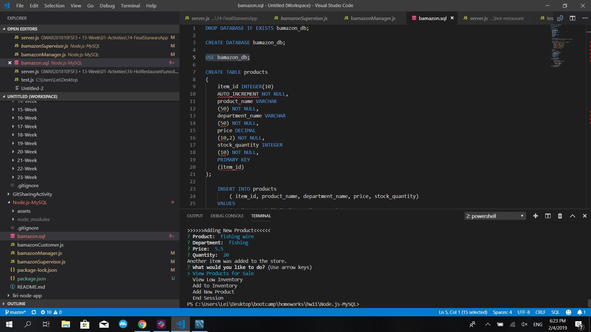
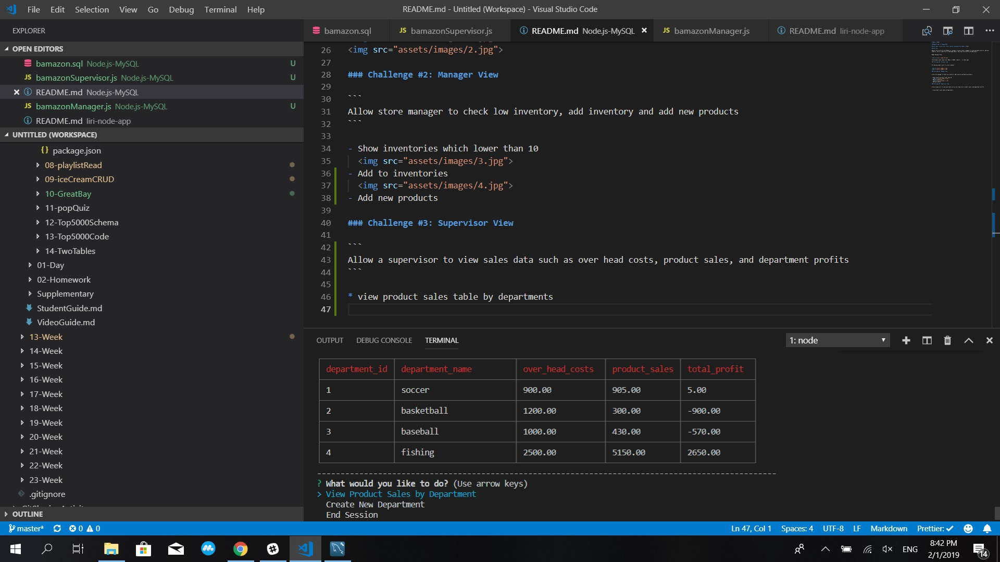
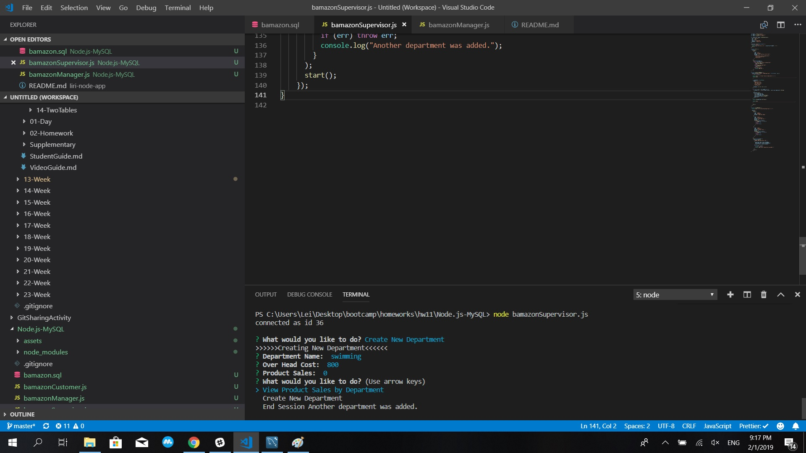

# Node.js-MySQL

## Bamazon app for Homework#12

## See Codes from Git-hub: https://github.com/daimon5lion/Node.js-MySQL

## Overview

Amazon-like storefront with MySQL for customers to place orders, managers to check and add inventory, add new products, and for supervisers to add departments, and view store profits by departments.

```
MySQL Database View
```


Technologies used: Javascript, Node.js, MySQL, inquirer, cli-table npms

### Challenge #1: Customer View

```
Purchasing products with "no-stock reminder", and record sales data in both products and departments table.
```


### Challenge #2: Manager View

```
Allow store manager to check low inventory, add inventory and add new products.
```

- Show inventories which lower than 10
  
- Add to inventories
  
- Add new products
  

### Challenge #3: Supervisor View

```
Allow a supervisor to view sales data such as over head costs, product sales, and department profits.
```

- View product sales table by departments
  

```
Also allow a supervisoer to creat new departments.
```

- Creat new departments
  
